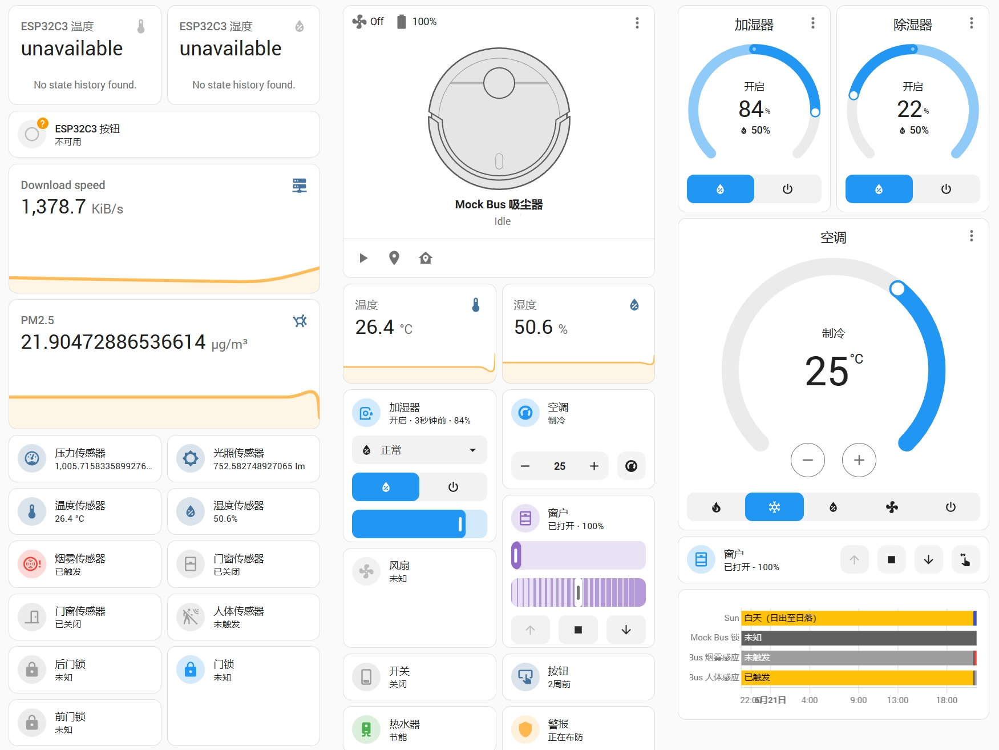

# HA-MQTT-mock

本项目提供一个简单的 MQTT mock 服务, 用来模拟 Home Assistant 中的各种 MQTT 设备。

在使用本服务前，你需要先配置好你的 Home Assistant 以及 MQTT 服务。

## 特性

本项目可以提供 Home Assistant 支持的大多数 MQTT 设备的模拟。以下是 Home Assistant 的仪表盘预览：



同时你也可以通过修改 `models/__init__.py` 文件来添加自定义的设备模型。

可以模拟的设备有：

| 设备类型       | 设备名称          | 设备的功能                                      |
| -------------- | ----------------- | ----------------------------------------------- |
| MQTT Device    | MQTT 设备         | 用于通用 MQTT 协议的设备                        |
| Light          | 灯                | 控制灯的开关、亮度、颜色等                      |
| BinarySensor   | 二进制传感器      | 检测两种状态（如开/关、移动/静止）的传感器      |
| Sensor         | 传感器            | 收集和报告数据的设备                            |
| Switch         | 开关              | 控制电源的开关                                  |
| Fan            | 风扇              | 控制风扇的开关、速度、方向等                    |
| Climate        | 气候控制          | 控制空调、加热器等温度设备                      |
| Humidifier     | 加湿器            | 控制加湿器的开关、湿度等                        |
| Lock           | 锁                | 控制门锁的开锁、上锁                            |
| Vacuum         | 扫地机器人        | 控制扫地机器人的启动、停止、清扫模式等          |
| WaterHeater    | 热水器            | 控制热水器的开关、温度等                        |
| Button         | 按钮              | 触发一次性操作的设备                            |
| Valve          | 阀门              | 控制水、气等流体的开关                          |
| LawnMower      | 割草机            | 控制割草机的启动、停止、割草模式等              |
| Cover          | 遮挡物            | 控制窗帘、百叶窗等遮挡物的开关、位置等          |
| Alarm          | 报警器            | 提供报警功能，如入侵报警、烟雾报警等            |


你可以通过修改每个类中的 `update_state_mock()` 方法来自定义设备的模拟行为。


## 项目结构

以下是项目的文件结构：

```
.
├── Makefile                # Makefile 文件
├── README.md               # 本文件
├── config.py               # 配置信息, 包括 MQTT 服务器地址、端口等
├── custom_listener.py      # 自定义监听钩子
├── dashboard.yaml          # 示例的 Home Assistant 的仪表盘文件
├── main.py                 # 主程序文件
├── models                  # MQTT 设备模型
│   ├── __init__.py         # MQTT 设备模型的初始化文件
│   └── mock.py             # 模拟行为文件
├── requirements.txt        # 项目依赖
└── utils.py                # 工具函数
```

## 使用方法

1. 克隆仓库
```bash
git clone [this-repo]
```

2. 配置 MQTT 服务器地址

修改 `config.py` 文件中的 `BROKER_ADDRESS` 和 `BROKER_PORT` 变量为你的 MQTT 服务器地址和端口。如果你的 MQTT 服务器需要用户名和密码，请修改 `USERNAME` 和 `PASSWORD` 变量。

```python
BROKER_ADDRESS = <your-mqtt-server>
BROKER_PORT = 1883

USERNAME = <your-username>
PASSWORD = <your-password>
ROOT_PREFIX = "homeassistant"

```

3. 安装依赖

你可以使用 `pip` 来安装项目的依赖：

```bash
pip install -r requirements.txt
```

Linux 用户可以使用 `make` 命令来配置虚拟环境并安装依赖：

```bash
make install
```

4. 运行程序

你可以直接运行 `main.py` 文件来启动 MQTT mock 服务：

```bash
python main.py
```

或者使用 `make` 命令：

```bash
make run
```

5. 配置 Home Assistant

如果一切顺利的话，Home Assistant 将会自动发现你的 MQTT 设备。你可以在 Home Assistant 的仪表盘中看到你的设备。

6. 配置 Home Assistant 的仪表盘

你可以使用我提供的 `dashboard.yaml` 文件来配置 Home Assistant 的仪表盘。你也可以自行配置仪表盘。


## 贡献

如果你有任何问题或建议，欢迎提交 issue 或者 PR。

## 许可证

本项目基于 MIT 许可证进行许可 - 详细信息请参阅 [LICENSE](LICENSE) 文件。
