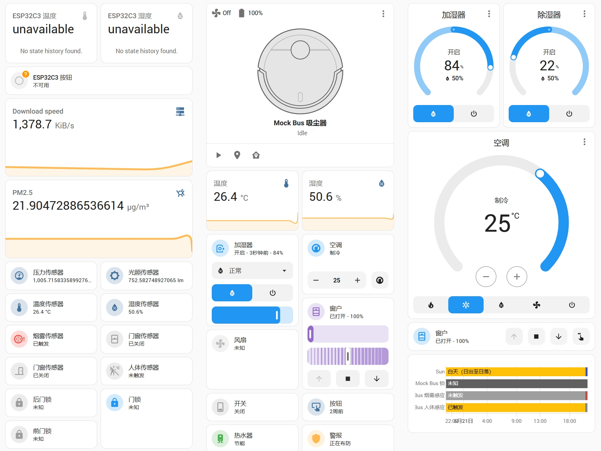

# HA-MQTT-mock

>[!NOTE]
> Original README.md is in Chinese. This is the English translation by Copilot.


This project provides a simple MQTT mock service to simulate various MQTT devices in Home Assistant.

Before using this service, you need to configure your Home Assistant and MQTT service.

## Features

This project can simulate most MQTT devices supported by Home Assistant. Here is a preview of the Home Assistant dashboard:



You can also add custom device models by modifying the `models/__init__.py` file.

The following devices can be simulated:

| Device Type  | Device Name     | Device Function                                                    |
| ------------ | --------------- | ------------------------------------------------------------------ |
| MQTT Device  | MQTT Device     | Device for generic MQTT protocol                                   |
| Light        | Light           | Control the on/off, brightness, color, etc. of lights              |
| BinarySensor | Binary Sensor   | Sensor that detects two states (e.g., open/close, motion/still)    |
| Sensor       | Sensor          | Device that collects and reports data                              |
| Switch       | Switch          | Control the power on/off of devices                                |
| Fan          | Fan             | Control the on/off, speed, direction, etc. of fans                 |
| Climate      | Climate Control | Control the temperature of air conditioners, heaters, etc.         |
| Humidifier   | Humidifier      | Control the on/off, humidity, etc. of humidifiers                  |
| Lock         | Lock            | Control the unlock/lock of doors                                   |
| Vacuum       | Vacuum          | Control the start/stop, cleaning mode, etc. of vacuum cleaners     |
| WaterHeater  | Water Heater    | Control the on/off, temperature, etc. of water heaters             |
| Button       | Button          | Device that triggers one-time operations                           |
| Valve        | Valve           | Control the on/off of fluids like water, gas, etc.                 |
| LawnMower    | Lawn Mower      | Control the start/stop, mowing mode, etc. of lawn mowers           |
| Cover        | Cover           | Control the on/off, position, etc. of blinds, shutters, etc.       |
| Alarm        | Alarm           | Provide alarm functions such as intrusion alarm, smoke alarm, etc. |


You can customize the device simulation behavior by modifying the `update_state_mock()` method in each class.


## Project Structure

Here is the file structure of the project:

```
.
├── Makefile                # Makefile file
├── README.md               # This file
├── config.py               # Configuration information, including MQTT server address, port, etc.
├── custom_listener.py      # Custom listener hook
├── dashboard.yaml          # Example Home Assistant dashboard file
├── main.py                 # Main program file
├── models                  # MQTT device models
│   ├── __init__.py         # Initialization file for MQTT device models
│   └── mock.py             # Mock behavior file
├── requirements.txt        # Project dependencies
└── utils.py                # Utility functions
```

## Usage

1. Clone the repository
```bash
git clone [this-repo]
```

2. Configure MQTT server address

Modify the `BROKER_ADDRESS` and `BROKER_PORT` variables in the `config.py` file to your MQTT server address and port. If your MQTT server requires a username and password, modify the `USERNAME` and `PASSWORD` variables.

```python
BROKER_ADDRESS = <your-mqtt-server>
BROKER_PORT = 1883

USERNAME = <your-username>
PASSWORD = <your-password>
ROOT_PREFIX = "homeassistant"

```

3. Install dependencies

You can use `pip` to install the project dependencies:

```bash
pip install -r requirements.txt
```

Linux users can use the `make` command to configure a virtual environment and install dependencies:

```bash
make install
```

4. Run the program

You can directly run the `main.py` file to start the MQTT mock service:

```bash
python main.py
```

Or use the `make` command:

```bash
make run
```

5. Configure Home Assistant

If everything goes well, Home Assistant will automatically discover your MQTT devices. You can see your devices in the Home Assistant dashboard.

6. Configure the Home Assistant dashboard

You can use the provided `dashboard.yaml` file to configure the Home Assistant dashboard. You can also customize the dashboard yourself.


## Contribution

If you have any questions or suggestions, feel free to submit an issue or PR.

## License

This project is licensed under the MIT License - see the [LICENSE](LICENSE) file for details.

